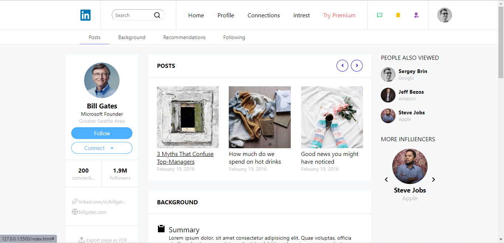

# loop2step10

_An implementation of Company LinkedIn Profile with HTML/CSS_

## Getting Started

Clone or download this repository and run with a local server of open `index.html` with your favorite browser

## Prequisite

- Your browser version must be recent for a better experience

## Features

- Profile
- Background
- Experience
- Recommendation
- Skills

## Tech/framework used

- HTML
- CSS

## Demo

[Preview Here](https://rawcdn.githack.com/PrimeFord/loop2step10/7c8a9caba74d6eff3cffb1f670ca3a166cf6d425/index.html)

## Contact

If you want to contact me you can reach me at
-wolabash@gmail.com -https://github.com/PrimeFord

## Addtional Info

- This is one of the series of project for the @Codevillage Programming Lessons.
- This is not meant for production. It's for learning purpose only
